**Per quanto riguarda il cambio di lingua nel tutorial, fare riferimento alla seguente immagine animata.**

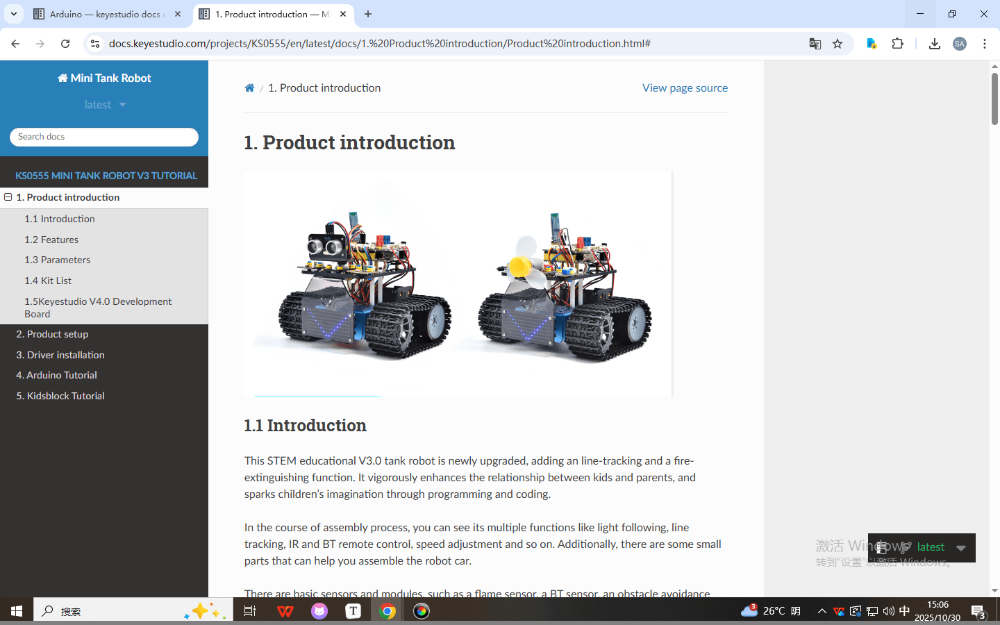

 [Tutorial Arduino](./Arduino/Arduino.7z) 

 [Tutorial Kidsblock](./Kidsblock/Kidsblock.7z) 

# 1. Introduzione al prodotto  

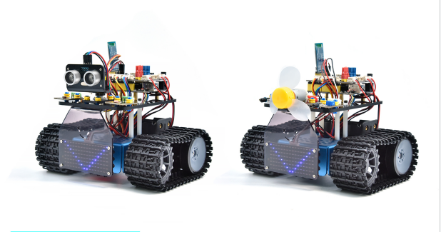

## 1.1 Introduzione

Questo robot carro armato STEM educativo V3.0 è stato recentemente aggiornato, aggiungendo una funzione di tracciamento linea e una funzione di estinzione incendi. Migliora vigorosamente la relazione tra bambini e genitori e accende l'immaginazione dei bambini attraverso la programmazione e la codifica.

Durante il processo di assemblaggio, è possibile vedere le sue molteplici funzioni come il seguire la luce, il tracciamento linea, il controllo remoto IR e BT, la regolazione della velocità e così via. Inoltre, ci sono alcune piccole parti che possono aiutarti ad assemblare l'auto robot.

Sono inclusi sensori e moduli di base, come un sensore di fiamma, un sensore BT, un sensore di evitamento ostacoli, un sensore di tracciamento linea e un sensore ultrasonico.

I due tutorial per il codice in linguaggio C dell'IDE Arduino e la programmazione grafica KidsBlock sono adatti anche per gli appassionati di diverse età.

È davvero la scelta migliore per te.

## 1.2 Caratteristiche

1. Funzioni multiple: Confinamento, tracciamento linea, estinzione incendi, seguire la luce, controllo remoto IR e BT, controllo della velocità e così via.

2. Facile da costruire: assembla il robot con alcune parti.

3. Elevata tenacità: Staffe in lega di alluminio, motori metallici, ruote di alta qualità

4. Elevata estensione: collega molti sensori e moduli tramite lo scudo del driver del motore e le parti LEGO

5. Controlli multipli: Controllo remoto IR, controllo tramite App (sistemi iOS e Android)

6. Programmazione di base: codice in linguaggio C dell'IDE Arduino e programmazione grafica KidsBlock.

## 1.3 Parametri

- Tensione di lavoro: 5V

- Tensione di ingresso: 6-9V

- Corrente di uscita massima: 1.5A

- Dissipazione di potenza massima: 32W

- Velocità del motore: 5V 200 rpm / min

- Modalità di azionamento del motore: doppio ponte H (HR8833)

- Angolo di induzione ultrasonica: \<15°

- Distanza di rilevamento ultrasonica: 2cm-300cm

- Distanza del telecomando a infrarossi: 10 metri (misurata)

- Distanza del telecomando BT: 30 metri (misurata)

## 1.4 Elenco del kit

| No.  |                             Nome                             | QTY  |                           Immagine                            |
| ---- | :----------------------------------------------------------: | ---- | :----------------------------------------------------------: |
| 1    | Telaio robot carro armato（**Si prega di portare due batterie 18650**） | 1    |                    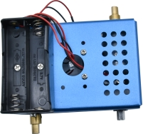                    |
| 2    |  Scheda di sviluppo Keyestudio V4.0 (compatibile Arduino UNO)  | 1    |       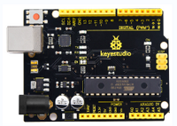        |
| 3    |         Scheda di espansione driver motore Keyestudio 8833         | 1    |       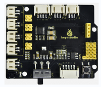       |
| 4    |                  Modulo BT BLE DX-BT24 V5.1                  | 1    |      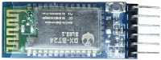       |
| 5    |                  Sensore ultrasonico HC-SR04                   | 1    |       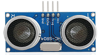        |
| 6    |                  Pannello LED Keyestudio 8\*16                  | 1    |       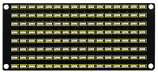        |
| 7    |                      Modulo LED Giallo                       | 1    |       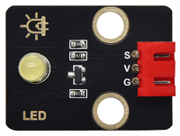       |
| 8    |                         Sensore di fiamma                         | 2    |       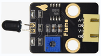       |
| 9    |                       Modulo motore 130                       | 1    |       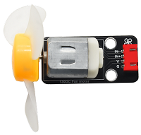       |
| 10   |                        Fotoresistore                         | 2    |       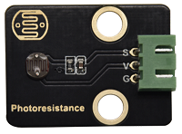       |
| 11   |              Scheda acrilica per pannello LED 8\*16               | 1    |       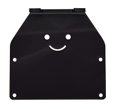       |
| 12   |                      Scheda acrilica superiore                       | 1    |       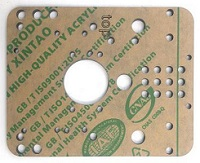       |
| 13   |                        Scheda acrilica                         | 1    |            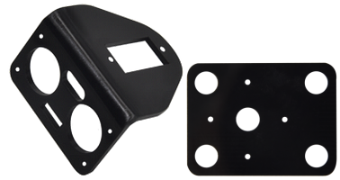            |
| 14   | Telecomando Keyestudio JMFP-4 17 tasti (Batterie in KS0555F) | 1    |             |
| 15   |                  Servo Keyestudio 9G 180 °                   | 1    |       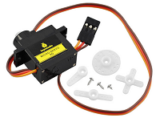        |
| 16   |                          Cavo USB                           | 1    |       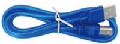        |
| 17   |                         Tubo avvolgente                         | 1    |       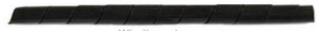        |
| 18   |                    Cacciavite 3.0\*40MM                     | 1    |       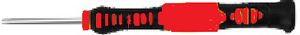        |
| 19   |                        Fascette 3\*100MM                         | 5    |               |
| 20   |                      Chiave a L M2.5                      | 1    |       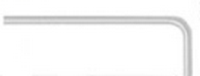        |
| 21   |                       Chiave a L M3                       | 1    |               |
| 22   |                      Chiave a L M1.5                      | 1    |               |
| 23   |                          Cartone                           | 1    |               |
| 24   |  Cavo Dupont 4P M-F PH2.0mm a 2.54 (Verde-Blu-Rosso-Nero)   | 1    |       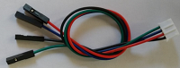        |
| 25   |        Cavo Dupont 4P HX-2.54 (Nero-Rosso-Bianco-Marrone)        | 1    |       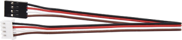       |
| 26   |                  Cavo Dupont 5P JST-PH2.0MM                  | 1    |       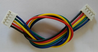        |
| 27   |     Cavo Dupont 3P-3P XH2.54 a 2.54（Giallo-Rosso-Nero)      | 1    |       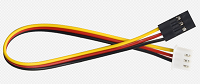       |
| 28   |     Cavo Dupont 3P-3P XH2.54 a PH2.0（Giallo-Rosso-Nero)     | 2    |     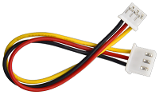      |
| 29   |     Cavo Dupont 4P-3P XH2.54 a PH2.0（Giallo-Rosso-Nero)     | 2    |      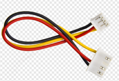       |
| 30   |    Cavo Dupont 4P XH2.54 a PH2.0（Verde-Blu-Rosso-Nero)     | 1    |       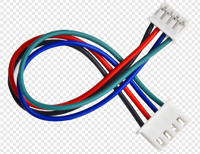       |
| 31   |                 Viti a testa tonda M1.4\*8MM                  | 6    |               |
| 32   |                          Dadi M1.4                           | 6    |       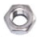        |
| 33   |                           Dadi M2                            | 8    |               |
| 34   |                  Viti a testa tonda M2\*8MM                   | 8    |               |
| 35   |                 Viti a testa tonda M1.2\*5MM                  | 6    |       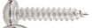        |
| 36   |                  Viti a testa tonda M3\*6MM                   | 18   |               |
| 37   |                  Viti a testa tonda M3\*10MM                  | 3    |               |
| 38   |                           Dadi M3                            | 3    |               |
| 39   |               Colonna di rame a doppio passaggio M3\*10MM               | 4    |       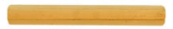        |
| 40   |                Boccola esagonale in rame (M3*45MM)                 | 4    | 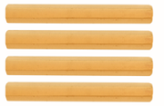 |
| 41   |       Perno assiale tecnico blu 43093 con creste di attrito       | 11   |       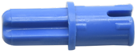        |
| 42   |                      Boccola tecnica 4265c                      | 11   |       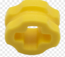        |
| 43   |                       Cappuccio ponticello blu                        | 4    |       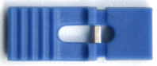        |
| 44   |                        Cappuccio ponticello rosso                        | 4    |       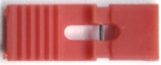        |
| 45   |                           Chiave inglese                            | 1    |                    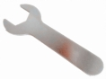                    |
| 46   |                    Ruota motrice del telaio                     | 2    |                    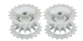                    |
| 47   |                    Ruota portante del telaio                     | 2    |                    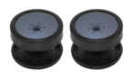                    |
| 48   |                 Vite a esagono incassato M4*12MM                 | 2    |                    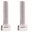                    |
| 49   |                 Vite a esagono incassato M4*35MM                 | 2    |                    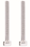                    |
| 50   |                          Cingolo a nastro                          | 2    |                    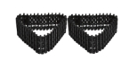                    |

## 1.5 Scheda di sviluppo Keyestudio V4.0

È necessario sapere che la scheda di sviluppo Keyestudio V4.0 è il cuore di questa smart car.

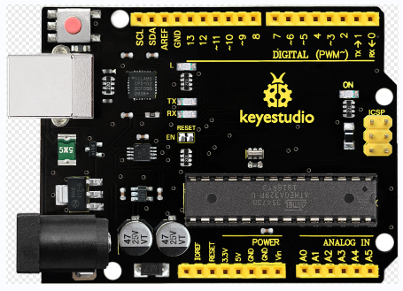

La scheda di sviluppo Keyestudio V4.0 è basata su MCU ATmega328P e con un chip CP2102 come convertitore UART-USB.

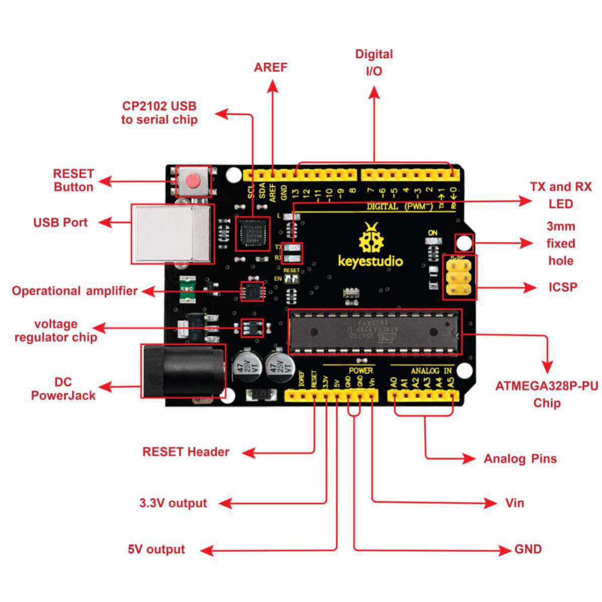

Dispone di 14 pin di ingresso/uscita digitali (di cui 6 possono essere utilizzati come uscite PWM), 6 ingressi analogici, un cristallo di quarzo da 16 MHz, una connessione USB, un jack di alimentazione, 2 header ICSP e un pulsante di reset.

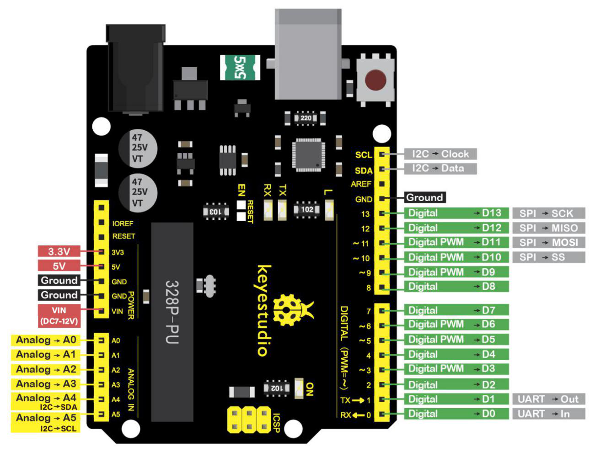

Possiamo alimentarlo con un cavo USB, il jack di alimentazione CC esterno (DC 7-12V) o i pin femmina Vin/GND (DC 7-12V)

|      Microcontrollore       |                      ATmega328P-PU                       |
| :-------------------------: | :------------------------------------------------------: |
|      Tensione operativa      |                            5V                            |
| Tensione di ingresso (raccomandata) |                         DC7-12V                          |
|      Pin I/O digitali       |       14 (D0-D13)  (di cui 6 forniscono uscita PWM)       |
|    Pin I/O digitali PWM     |               6 (D3, D5, D6, D9, D10, D11)               |
|      Pin di ingresso analogici      |                        6 (A0-A5)                         |
|   Corrente CC per pin I/O    |                          20 mA                           |
|   Corrente CC per pin 3.3V   |                          50 mA                           |
|        Memoria Flash         | 32 KB (ATmega328P-PU) di cui 0.5 KB utilizzati dal bootloader |
|            SRAM             |                   2 KB (ATmega328P-PU)                   |
|           EEPROM            |                   1 KB (ATmega328P-PU)                   |
|         Velocità di clock         |                          16 MHz                          |
|         LED_BUILTIN         |                           D13                            |
