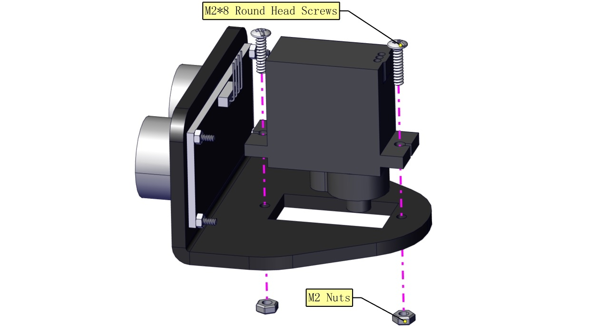

# 2. Configuración del producto

**Precaución**: Retire las películas delgadas de las placas antes de instalar este robot. Tenga en cuenta que el ángulo inicial del servo debe ajustarse durante la instalación.

**Paso 1**

Herramientas necesarias:

**Nota:** Preste atención a la dirección de instalación de las ruedas. El lado grueso debe estar hacia afuera.

**Paso 2**

Las ruedas y las orugas deben instalarse. Luego móntelas en la carrocería del coche simultáneamente. De lo contrario, las orugas no se podrán instalar.

**Nota:** Preste atención a dónde se montan las ruedas en las orugas.

**Paso 3**

**Nota:** Por favor, conecte los cables primero.

**Paso 4**

**Paso 5**

**Paso 6**

**Paso 7**

**Nota:** Preste atención a la dirección de los puentes.

**Paso 8**

**Paso 9**

**Paso 10**

(Es necesario ajustar el ángulo del servo)

**Ajuste el ángulo del servo a 90°**

Para ajustar el código del servo, seleccione el código correspondiente según el curso.

1.**Arduino:** Descargue el archivo de código: [Arduino](./Arduino.7z)

2.**Kidsblock:** Descargue el archivo de código: [Kidsblock](./Kidsblock.7z)

**Después de inicializar el ángulo del servo, instale el módulo Bluetooth.**

Mantenga el sensor ultrasónico paralelo a la placa.

**Paso 11**

**Paso 12**

**Cableado**

Para el panel LED 8*16, conecte los cables a A4 y A5.

Conecte el motor A al puerto A y el motor B al puerto B.

Conecte el cable de alimentación.

Sensor de seguimiento de línea (ver la imagen):

Conecte los fotorresistores:

| Fotorresistor | Placa Keyestudio 8833 |
| :-----------: | :-------------------: |
| G | G |
| V | V |
| S | A1 |

| Fotorresistor | Placa Keyestudio 8833 |
| :-----------: | :--------------------: |
| G | G |
| V | V |
| S | V2 |

Conecte el sensor ultrasónico:

| Sensor ultrasónico | Placa Keyestudio 8833 |
| :---------------: | :-------------------: |
| Vcc | V |
| Trig | D12 |
| Echo | D13 |
| Gnd | G |

Conecte el servo (D10):

| Servo | Placa Keyestudio 8833 |
| :----: | :-------------------: |
| Marrón | G |
| Rojo | V(5V) |
| Naranja | D10 |

**Adoptamos una batería de litio modelo 18650 con polo positivo puntiagudo, cuya potencia y capacidad no son requisitos.**

